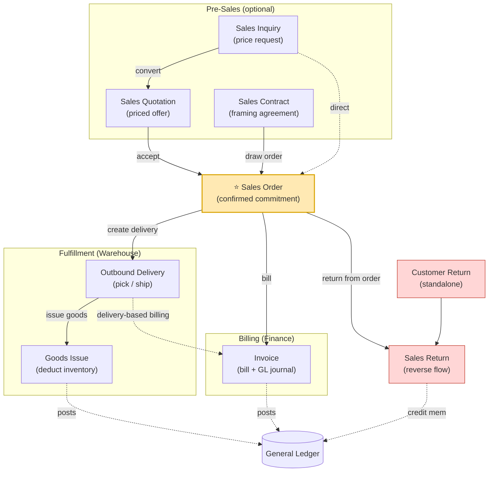

# Logistics Sales Cycle — Overview

> **Application:** Logistics API (`Logistics.Sales.Logic` / `Logistics.Sales.Data` / `Logistics.Application` / `Logistics.API`)
> **Bounded Context:** Sales
> **Last Updated:** 2026-06-04

## What is this? (for everyone)

The **Sales Cycle** is the end-to-end *Order-to-Cash* process in AccFlex ERP. It tracks a
customer's business from the very first request for a price, through ordering, physically
shipping the goods out of the warehouse, and finally billing the customer — plus handling
any goods the customer sends back.

Each step produces a **document**. Every document (except the first) is created **from** a
previous one, so quantities, prices, and customer details flow forward automatically and
nothing is keyed twice. This chain of linked documents is called the **Document Flow**, and
the user can open any document and trace it backward or forward through the whole cycle.

The person who benefits: **sales reps** (create inquiries/quotations/orders), **warehouse
staff** (deliver and issue goods), and **finance** (invoices, returns, collection).

## The Cycle at a Glance

| # | Document (Screen) | Who | Purpose | Mandatory? |
|---|-------------------|-----|---------|-----------|
| 1 | **Sales Inquiry** | Sales rep | Customer asks "what can you offer / at what price?" | Optional (pre-sales) |
| 2 | **Sales Quotation** | Sales rep | A formal, time-bound price offer to the customer | Optional |
| 3 | **Sales Contract** | Sales | Long-term framing agreement the customer draws orders against | Optional (alt. source) |
| 4 | **Sales Order** | Sales rep | The confirmed commitment to sell — **the heart of the cycle** | **Required** |
| 5 | **Outbound Delivery** | Warehouse | Plans/picks what physically leaves the warehouse | Required to ship |
| 6 | **Goods Issue** | Warehouse | Actually deducts the stock from inventory | Required to ship |
| 7 | **Invoice** | Finance | Bills the customer and posts the accounting entry | **Required** to bill |
| — | **Sales Return** | Finance/Sales | Customer returns goods (reverse flow) | As needed |

## Business Flow Summary (plain language)

1. A customer asks for a price → the rep records a **Sales Inquiry**.
2. The company answers with a **Sales Quotation** (a priced offer with a validity date).
3. The customer accepts → the rep raises a **Sales Order** *from* that quotation (or directly,
   or against a standing **Sales Contract**). The order must be **confirmed** before anything
   can ship — confirmation runs credit-limit and stock-availability checks.
4. The warehouse creates an **Outbound Delivery** for all or part of the ordered quantity.
5. The warehouse performs **Goods Issue**, which removes the stock from inventory and records
   the inventory accounting movement.
6. Finance issues an **Invoice**, which bills the customer and posts the revenue/receivable
   journal to the General Ledger.
7. If the customer returns goods, a **Sales Return** is recorded — either *from a Sales Order*
   or as a standalone *Customer Return* — reversing inventory and (via a credit memo) the money.

Each shipping/billing step can be done **partially**: a single Sales Order can be split across
several deliveries and several invoices over time. The order keeps three running status flags
so everyone can see how far it has progressed (see state machine below).

## Key Concepts

- **Document Flow** — the linked chain of documents. Each detail line carries the ID of the
  detail line it came from (`SalesInquiryDetailId` → `SalesQuotationDetailId` →
  `SalesOrderDetailId` → `OutboundDeliveryDetailId` → `InvoiceDetailId`), enabling full
  forward/backward traceability per line.
- **Sales Order as the hub** — almost every downstream document references back to a Sales
  Order detail. The order is the single source of truth for "what was promised."
- **Partial fulfillment** — quantities are consumed gradually; statuses move
  `Not Yet → Partially → Fully` as deliveries/issues/invoices accumulate.
- **Confirmation** — a Sales Order is a draft until confirmed (`IsConfirm`). Confirmation
  enforces business gates (credit limit, max debit period, stock availability) and may require
  the approval workflow depending on the license.
- **Stop Issuing** — an order or a line can be flagged `StopIssuing` to block further shipping.

## Aggregate Dependencies

The cycle spans these aggregate roots, all in `Logistics.Sales.Logic`:

| Aggregate Root                          | Role in Cycle                                                              | Feeds / References                              |
| --------------------------------------- | -------------------------------------------------------------------------- | ----------------------------------------------- |
| `SalesInquiry`                          | Step 1 — pre-sales request                                                 | → Sales Quotation                               |
| `SalesQuotation` (`SalesQuotationBase`) | Step 2 — priced offer; built `FromSalesInquiry` or `QuotationManually`     | ← Inquiry · → Sales Order                       |
| `Contract`                              | Alt. source — framing agreement                                            | → Sales Order                                   |
| `SalesOrder`                            | Step 4 — **central aggregate**; carries Outbound/GoodsIssue/Invoice status | ← Quotation/Contract · → Outbound, Invoice      |
| `OutboundDelivery`                      | Step 5 — picking/shipping document                                         | ← Sales Order · → Goods Issue                   |
| `GoodIssue`                             | Step 6 — inventory deduction                                               | ← Outbound (also production/movement sources)   |
| `Invoice`                               | Step 7 — billing + GL posting                                              | ← Sales Order / Outbound · → Customer Memo      |
| `SalesReturn`                           | Reverse flow                                                               | ← Sales Order **or** standalone Customer Return |

**Supporting (master / condition) aggregates referenced throughout:** `Customer`,
`SalesOrganization` (+ Sales Office), `Material`, `Currency`, `PriceList`, the Sales **condition**
aggregates (`SalesPriceCondition`, `SalesDiscountCondition`, `SalesTaxCondition`,
`SalesFreightCondition`), `PaymentTerm`, `PriceProcedure`, `InventoryLocation`/`InventoryManagement`,
and `SmartSalesSettings` (sales rep). Commission is handled by `CommissionPolicy` / `AccrualCommission`.

> **Architecture note (rule compliance):** these are all aggregates **within the Sales bounded
> context**, so they may reference each other inside `*.Logic`. Cross-context concerns (GL
> journal posting on Invoice/Goods Issue, currency) are orchestrated in `Logistics.Application`
> via `IApplicationTransaction`, not by direct cross-`*.Logic` references.

## Cross-Module Touch Points (flagged as integration risk)

- **General Ledger** — Goods Issue posts an inventory movement journal; Invoice posts the
  revenue/receivable journal (`JournalDescriptionFactoryForInvoice`). Returns post a credit memo.
- **Inventory** — Goods Issue and Outbound Delivery consume stock and reservations.
- **Production** — `DeliveryPlan` / `ProductionOrder` can feed make-to-order Sales Orders
  (see `DeliveryPlanFromSalesOrderDoucmentFlow`, `GoodIssueFromProductionOrderDocumentFlow`).
- **E-Invoice** — `Invoice.EInvoice` / `LogisticsEInvoiceController` integrate ZATCA/ETA e-invoicing.

## Process Flow Diagram



## Sales Order State Machine

The Sales Order tracks fulfillment with **three independent status flags**, each recalculated
from accumulated transaction quantities every time a downstream document is posted/cancelled
(`SalesOrder.cs` ~lines 2300–2360):

```
Lifecycle:   Draft ──confirm──▶ Confirmed ──(StopIssuing)──▶ Blocked

Each tracker independently:
  OutboundDeliveryStatus:  Not Yet ──▶ Partially ──▶ Fully
  GoodsIssueStatus:        Not Yet ──▶ Partially ──▶ Fully
  InvoiceStatus:           Not Yet ──▶ Partially ──▶ Fully
```

- A draft order **cannot** be delivered, issued, or invoiced.
- `StopIssuing` on the header (or any line) blocks new Goods Issues/Outbounds.
- Status returns to `Not Yet` if all downstream documents are cancelled (quantities reverse).

## Known Business Constraints

- A Sales Order must be **confirmed** before Outbound / Goods Issue / Invoice can be created.
- Confirmation enforces **credit limit**, **max debit / max debit period**, and **stock
  availability** — overrides require specific user permissions.
- Quantities are validated at every hop: you cannot deliver/issue/invoice **more** than the
  remaining open quantity of the source line.
- A Sales Quotation has a **validity (final) date**; an inquiry has a final date too.
- Returns reference either a Sales Order line (`ReturnFromSalesOrder`) or are standalone
  (`CustomerReturn`) — see `SalesReturnSource`.

## Detailed Notes

- [[SalesCycle-DocumentFlow]] — developer & QA deep-dive: per-line traceability, status
  recalculation logic, transaction quantities, and end-to-end test scenarios.

## Open Questions / Gaps

- [ ] Confirm exact approval-workflow trigger conditions (license-dependent: `isLicenseContainsApprovalSystem`).
- [ ] Document the delivery-based vs order-based invoicing decision (when is each path used?).
- [ ] Clarify advance-payment invoice flow (`InvoiceAdvancePaymentInvoices`, `AdvancePaymentsPaidAmount`).
