# Concrete Cycle (Ready Mix Delivery) — Knowledge Graph

> **Application:** Logistics — Production Module
> **Source Project:** `Logistics.Production.Logic`
> **Last Updated:** 2026-06-10
> **Entities Covered:** 20 domain entities + 2 state machines + 5 domain events

---

## Entity Relationship Diagram

```mermaid
graph TD

    %% ── SALES LAYER ─────────────────────────────────────────
    SO["SalesOrder\n(Aggregate Root)"]
    SOD["SalesOrderDetail\n(child)"]
    SODSched["SalesOrderDetailDeliveySchedule\n(child)"]

    %% ── CONCRETE SPECS ───────────────────────────────────────
    Spec_Grade["Grade\n(spec lookup)"]
    Spec_Slump["SlumpLevel\n(spec lookup)"]
    Spec_MaxAgg["MaxAggregateSize\n(spec lookup)"]
    Spec_Temp["Temperature\n(spec lookup)"]
    Spec_AggMix["AggregateMix\n(spec lookup)"]
    Spec_Adm["AdmixtureDosageQuantity\n(spec lookup)"]
    Spec_Water["WaterAndCold\n(spec lookup)"]
    Spec_AddedMat["AddedMaterials\n(spec lookup)"]
    Spec_Mix["MixtureDesign\n(spec lookup)"]

    %% ── BOM LAYER ────────────────────────────────────────────
    BOM["BillOfMaterial\n(Aggregate Root)"]
    BOMDetail["BillOfMaterialDetail\n(child — raw material lines)"]
    BOMTechSpec["BillOfMaterialTechnicalSpecifications\n(child — concrete spec group)"]
    BOMScrap["BillOfMaterialScrap\n(child)"]
    BOMInvMgmt["BillOfMaterialInventoryManagement\n(junction)"]

    %% ── DELIVERY PLAN LAYER ──────────────────────────────────
    DP["DeliveryPlanFromSalesOrder\n(Aggregate Root)"]
    DPDetail["DeliveryPlanDetailFromSalesOrder\n(child — mixer truck trip)"]
    DPPump["DeliveryPlanPumpFromSalesOrder\n(child — pump assignment)"]
    DPDetailRM["DeliveryPlanDetailRawMaterial\n(child — BOM material quantities)"]

    %% ── INVOICE LAYER ────────────────────────────────────────
    INV["Invoice\n(Aggregate Root)"]
    INVDetail["InvoiceDetail\n(child)"]

    %% ── MASTER DATA ──────────────────────────────────────────
    Customer["Customer"]
    Car["Car\n(Mixer Truck / Pump)"]
    Driver["Driver"]
    Station["Station\n(Batching Plant)"]
    SalesOrg["SalesOrganization"]

    %% ── DOMAIN EVENTS ────────────────────────────────────────
    GIEvent[["CreateGoodIssueOnDeliveryPlanEvent"]]
    JournalEvent[["CreateDeliveryPlanJournalDomainEvent"]]
    RedirectSOEvent[["CreateRedirectedSalesOrderForDeliveryPlanDomainEvent"]]
    RecalcQtyEvent[["ReCalculateSalesOrderTotalActualIssuedQuantityEvent"]]
    RoutingEvent[["RoutingBomRedistributeNeededEvent"]]

    %% ─────────────────────────────────────────────────────────
    %% RELATIONSHIPS
    %% ─────────────────────────────────────────────────────────

    %% Sales layer
    SO -->|"HAS many"| SOD
    SO -->|"HAS many"| SODSched
    SO -->|"BELONGS TO"| Customer
    SO -->|"BELONGS TO"| SalesOrg
    SOD -->|"references"| BOM
    SOD -->|"located at"| Station
    SOD -->|"HAS spec"| Spec_Grade
    SOD -->|"HAS spec"| Spec_Slump
    SOD -->|"HAS spec"| Spec_MaxAgg
    SOD -->|"HAS spec"| Spec_Temp
    SOD -->|"HAS spec"| Spec_AggMix
    SOD -->|"HAS spec"| Spec_Adm
    SOD -->|"HAS spec"| Spec_Water
    SOD -->|"HAS spec"| Spec_AddedMat
    SOD -->|"HAS spec"| Spec_Mix

    %% BOM layer
    BOM -->|"HAS many"| BOMDetail
    BOM -->|"HAS many"| BOMTechSpec
    BOM -->|"HAS many"| BOMScrap
    BOM -->|"linked to inv mgmt via"| BOMInvMgmt
    BOMTechSpec -->|"references spec"| Spec_Grade
    BOMTechSpec -->|"references spec"| Spec_Slump
    BOMTechSpec -->|"references spec"| Spec_MaxAgg
    BOMTechSpec -->|"references spec"| Spec_Temp
    BOMTechSpec -->|"references spec"| Spec_AggMix
    BOMTechSpec -->|"references spec"| Spec_Adm
    BOMTechSpec -->|"references spec"| Spec_Water
    BOMTechSpec -->|"references spec"| Spec_AddedMat
    BOM -->|"TRIGGERS on update"| RoutingEvent

    %% Delivery Plan layer
    DP -->|"HAS many"| DPDetail
    DP -->|"HAS many"| DPPump
    DP -->|"derives from"| SO
    DPDetail -->|"uses BOM"| BOM
    DPDetail -->|"HAS many"| DPDetailRM
    DPDetail -->|"HAS spec"| Spec_Grade
    DPDetail -->|"HAS spec"| Spec_Slump
    DPDetail -->|"HAS spec"| Spec_MaxAgg
    DPDetail -->|"HAS spec"| Spec_Temp
    DPDetail -->|"HAS spec"| Spec_AggMix
    DPDetail -->|"HAS spec"| Spec_Adm
    DPDetail -->|"HAS spec"| Spec_Water
    DPDetail -->|"HAS spec"| Spec_AddedMat
    DPDetail -->|"HAS spec"| Spec_Mix
    DPDetail -->|"assigned to"| Car
    DPDetail -->|"driven by"| Driver
    DPPump -->|"assigned to"| Car
    DP -->|"TRIGGERS"| GIEvent
    DP -->|"TRIGGERS"| JournalEvent
    DP -->|"TRIGGERS on redirect"| RedirectSOEvent
    DP -->|"TRIGGERS"| RecalcQtyEvent

    %% Invoice layer
    INV -->|"HAS many"| INVDetail
    INV -->|"references"| SO
    INV -->|"references"| Customer

    %% ─────────────────────────────────────────────────────────
    %% STYLING
    %% ─────────────────────────────────────────────────────────
    classDef aggregate fill:#4A90D9,stroke:#2c6fad,color:#fff,font-weight:bold
    classDef child fill:#7BB8F0,stroke:#4A90D9,color:#000
    classDef spec fill:#B0D4F1,stroke:#7BB8F0,color:#000,font-style:italic
    classDef master fill:#50C878,stroke:#3a9a5c,color:#000
    classDef event fill:#FFB347,stroke:#e09020,color:#000,font-style:italic
    classDef junction fill:#E8E8E8,stroke:#999,color:#555

    class SO,BOM,DP,INV,Spec_Mix aggregate
    class SOD,SODSched,BOMDetail,BOMTechSpec,BOMScrap,DPDetail,DPPump,DPDetailRM,INVDetail child
    class Spec_Grade,Spec_Slump,Spec_MaxAgg,Spec_Temp,Spec_AggMix,Spec_Adm,Spec_Water,Spec_AddedMat spec
    class Customer,Car,Driver,Station,SalesOrg master
    class GIEvent,JournalEvent,RedirectSOEvent,RecalcQtyEvent,RoutingEvent event
    class BOMInvMgmt junction
```



---

## State Machines

### DeliveryPlanDetail — Trip Status

```
NotStarted ──[dispatch truck]──► OnWay ──[confirmed delivered]──► Delivered
                                    │
                                    ├──[concrete rejected, poured out]──► RejectedAndScrapped
                                    │
                                    └──[redirected to another customer]──► RejectedAndRedirectedToAnotherCustomer
                                                │
                                                └──[auto-creates new DeliveryPlan + optional new SalesOrder]
```

| Status | Id | Can Transition To |
|--------|----|--------------------|
| NotStarted | 1 | OnWay only |
| OnWay | 2 | Delivered, RejectedAndScrapped, RejectedAndRedirectedToAnotherCustomer |
| Delivered | 5 | OnWay (correction only) |
| RejectedAndScrapped | 3 | OnWay (correction only) |
| RejectedAndRedirectedToAnotherCustomer | 4 | OnWay (correction only) |

### MixerTripState — Physical Truck Location Tracking

Runs in parallel with DetailStatus to track the mixer truck's physical progress:

```
NotStarted(0) → ExitPlant(1) → OnSite(2) → StartDischarge(3) → EndDischarge(4) → ReturnedPlant(5)
```

Each state transition records a timestamp (`TimeEXPlant`, `TimeOnSite`, `StartDischargeDate`, `EndDischargeDate`, `TimeReturndPlant`).

---

## Entity Index

| Entity | Layer | Type | Responsibility |
|--------|-------|------|---------------|
| `SalesOrder` | Domain | Aggregate Root | Customer order for ready-mix concrete — the cycle entry point |
| `SalesOrderDetail` | Domain | Child | Single concrete line with full technical spec + delivery tracking |
| `SalesOrderDetailDeliveySchedule` | Domain | Child | Scheduled delivery windows per SO detail |
| `BillOfMaterial` | Domain | Aggregate Root | Concrete mix recipe — raw materials + technical specifications |
| `BillOfMaterialDetail` | Domain | Child | One raw material line (cement, sand, gravel, water) with quantity |
| `BillOfMaterialTechnicalSpecifications` | Domain | Child | Spec profile: grade, slump, aggregate size, temperature, admixture |
| `BillOfMaterialScrap` | Domain | Child | Expected scrap/waste per BOM run |
| `DeliveryPlanFromSalesOrder` | Domain | Aggregate Root | One concrete delivery event (date + trucks + pumps) against a SO |
| `DeliveryPlanDetailFromSalesOrder` | Domain | Child | One mixer truck trip — status tracked, journals created |
| `DeliveryPlanPumpFromSalesOrder` | Domain | Child | Pump assignment for a delivery plan |
| `DeliveryPlanDetailRawMaterial` | Domain | Child | Actual raw material quantities per truck trip |
| `Invoice` | Domain | Aggregate Root | Billing document generated from delivered SalesOrder |
| `InvoiceDetail` | Domain | Child | Per-material invoice line |
| `MixtureDesign` | Domain | Aggregate Root | Named mix design lookup (e.g., C25, C30, C40) |
| `SlumpLevel` | Domain | Lookup | Concrete workability level (e.g., S1–S5) |
| `MaxAggregateSize` | Domain | Lookup | Maximum aggregate particle size (mm) |
| `AggregateMix` | Domain | Lookup | Aggregate blend ratio |
| `Temperature` | Domain | Lookup | Concrete temperature range |
| `AdmixtureDosageQuantity` | Domain | Lookup | Chemical admixture dosage |
| `WaterAndCold` | Domain | Lookup | Water/ice ratio spec |
| `AddedMaterials` | Domain | Lookup | Additional materials (silica fume, fly ash, etc.) |
| `Car` | Master Data | Entity | Mixer truck or pump vehicle — category determines role |
| `Driver` | Master Data | Entity | Truck driver or pump operator |
| `Station` | Master Data | Entity | Batching plant (concrete mixing station) |
| `Customer` | Master Data | Entity | Concrete buyer |
| `SalesOrganization` | Master Data | Entity | Selling entity |

---

## Cycle Flow (Business Narrative)

```
1. SALES ORDER
   └── Customer places order for concrete
       ├── Specifies product material, quantity, delivery date
       ├── Attaches technical specs: Grade + SlumpLevel + MixtureDesign + Temperature + ...
       └── Links to BillOfMaterial (the concrete recipe for this product)

2. DELIVERY SCHEDULE (optional)
   └── SO can have delivery schedule windows constraining delivery volume per period

3. DELIVERY PLAN
   └── Dispatcher creates a delivery plan against the SO
       ├── Selects mixer trucks (Cars, category=Truck)
       ├── Optionally assigns a pump (Car, category=Pump)
       ├── Each truck gets a DeliveryPlanDetail with status=NotStarted or OnWay
       └── Truck trips carry the BOM reference and concrete spec copies

4. MIXER TRIP EXECUTION
   └── Real-time tracking via TripState:
       ExitPlant → OnSite → StartDischarge → EndDischarge → ReturnedPlant
       Each milestone records a timestamp

5. TRIP OUTCOME
   └── After discharge, dispatcher sets DetailStatus:
       ├── Delivered → cost journal + goods issue created
       ├── RejectedAndScrapped → scrap cost journal
       └── RejectedAndRedirectedToAnotherCustomer
           └── New DeliveryPlan auto-created for redirect customer
               optionally with new SalesOrder or linked to existing SO

6. GOODS ISSUE
   └── Auto-triggered on delivery: raw materials consumed from inventory
       → GoodIssueNumber stamped on DeliveryPlanDetail

7. ACCOUNTING JOURNAL
   └── Cost journal created per trip:
       DeliveredQuantityCost = (DeliveredQty / RecipeQty) × TotalRawMaterialCost

8. INVOICE
   └── Finance creates Invoice from the SalesOrder after deliveries complete
       → Invoice links back to SalesOrder + Customer
```

---

## Key Cross-Cutting Relationships

| From | To | Relationship | Notes |
|------|----|--------------|-------|
| `SalesOrderDetail` | `BillOfMaterial` | `BillOfMaterialId` FK | BOM must be active + linked to matching InventoryManagement |
| `DeliveryPlanDetail` | `BillOfMaterial` | `BillOfMaterialId` FK | Validated at delivery plan create/update |
| `DeliveryPlanFromSalesOrder` | `SalesOrder` | `SalesOrderId` FK | Delete blocked if SO has been invoiced |
| `DeliveryPlanDetail` | `Car` | `CarId` FK | Car must be category=Truck for mixer details |
| `Invoice` | `SalesOrder` | `SalesOrderId` FK | Drives delete protection on delivery plans |
| `BillOfMaterial` | `InventoryManagement` | via `BillOfMaterialInventoryManagement` | BOM valid only for specific plants |

---

## Relationship Legend

| Arrow | Meaning |
|-------|---------|
| `-->|HAS many|` | Aggregate owns child collection |
| `-->|derives from|` | Delivery plan references its source Sales Order |
| `-->|uses BOM|` | Hard BOM dependency — delivery detail must have valid, active BOM |
| `-->|TRIGGERS|` | Domain event emitted → background job picks it up |
| `-->|references spec|` | Lookup FK to concrete spec table |
| `-->|assigned to|` | Operational assignment (truck, driver) |
