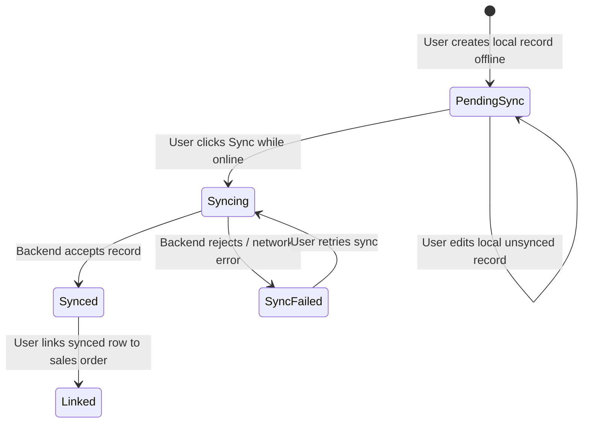

```mermaid
stateDiagram-v2
 [*] --> PendingSync: User creates local record offline
    PendingSync --> PendingSync: User edits local unsynced record
    PendingSync --> Syncing: User clicks Sync while online
    Syncing --> Synced: Backend accepts record
    Syncing --> SyncFailed: Backend rejects / network error
    SyncFailed --> Syncing: User retries sync
    Synced --> Linked: User links synced row to sales order
```

