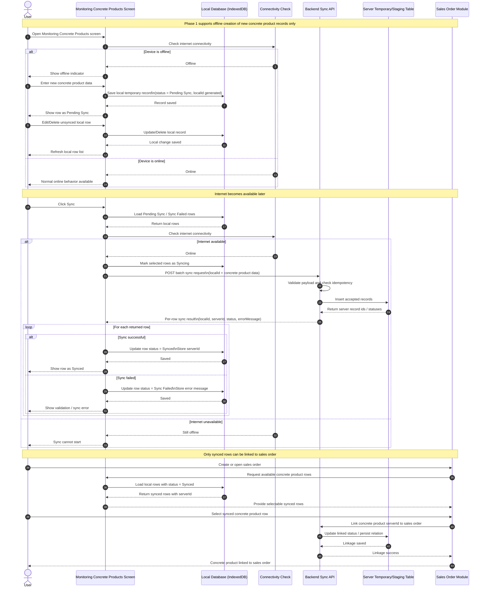

```mermaid
	sequenceDiagram
	    autonumber
	    actor User
	    participant UI as Monitoring Concrete Products Screen
	    participant LocalDB as Local Database (IndexedDB)
	    participant Network as Connectivity Check
	    participant SyncAPI as Backend Sync API
	    participant TempTable as Server Temporary/Staging Table
	    participant SalesOrder as Sales Order Module
	
	    Note over User,SalesOrder: Phase 1 supports offline creation of new concrete product records only
	
	    User->>UI: Open Monitoring Concrete Products screen
	    UI->>Network: Check internet connectivity
	
	    alt Device is offline
	        Network-->>UI: Offline
	        UI-->>User: Show offline indicator
	
	        User->>UI: Enter new concrete product data
	        UI->>LocalDB: Save local temporary record\n(status = Pending Sync, localId generated)
	        LocalDB-->>UI: Record saved
	        UI-->>User: Show row as Pending Sync
	
	        User->>UI: Edit/Delete unsynced local row
	        UI->>LocalDB: Update/Delete local record
	        LocalDB-->>UI: Local change saved
	        UI-->>User: Refresh local row list
	
	    else Device is online
	        Network-->>UI: Online
	        UI-->>User: Normal online behavior available
	    end
	
	    Note over User,SalesOrder: Internet becomes available later
	
	    User->>UI: Click Sync
	    UI->>LocalDB: Load Pending Sync / Sync Failed rows
	    LocalDB-->>UI: Return local rows
	    UI->>Network: Check internet connectivity
	
	    alt Internet available
	        Network-->>UI: Online
	        UI->>LocalDB: Mark selected rows as Syncing
	        UI->>SyncAPI: POST batch sync request\n(localId + concrete product data)
	        SyncAPI->>SyncAPI: Validate payload and check idempotency
	        SyncAPI->>TempTable: Insert accepted records
	        TempTable-->>SyncAPI: Return server record ids / statuses
	        SyncAPI-->>UI: Per-row sync result\n(localId, serverId, status, errorMessage)
	
	        loop For each returned row
	            alt Sync successful
	                UI->>LocalDB: Update row status = Synced\nStore serverId
	                LocalDB-->>UI: Saved
	                UI-->>User: Show row as Synced
	            else Sync failed
	                UI->>LocalDB: Update row status = Sync Failed\nStore error message
	                LocalDB-->>UI: Saved
	                UI-->>User: Show validation / sync error
	            end
	        end
	
	    else Internet unavailable
	        Network-->>UI: Still offline
	        UI-->>User: Sync cannot start
	    end
	
	    Note over User,SalesOrder: Only synced rows can be linked to sales order
	
	    User->>SalesOrder: Create or open sales order
	    SalesOrder->>UI: Request available concrete product rows
	    UI->>LocalDB: Load local rows with status = Synced
	    LocalDB-->>UI: Return synced rows with serverId
	    UI-->>SalesOrder: Provide selectable synced rows
	
	    User->>SalesOrder: Select synced concrete product row
	    SalesOrder->>SyncAPI: Link concrete product serverId to sales order
	    SyncAPI->>TempTable: Update linked status / persist relation
	    TempTable-->>SyncAPI: Linkage saved
	    SyncAPI-->>SalesOrder: Linkage success
	    SalesOrder-->>User: Concrete product linked to sales order
```